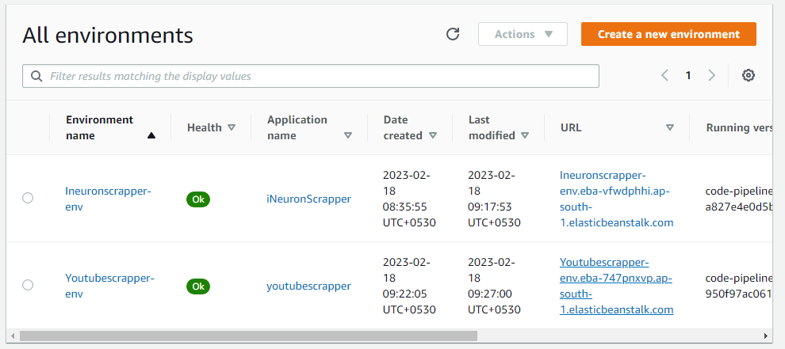

# YouTube Video Details Scrapper
1. AWS screenshot
    
    - Search Box and the fetch button is to fetch Video Detais based on given Video URL from Youtube
    - Chnnel Details of required channels are displayed
2. Azure link screenshot
    
3. Video Details  
    
4. Deployed Environment on AWS
    
5. MongoDB Collection
    
